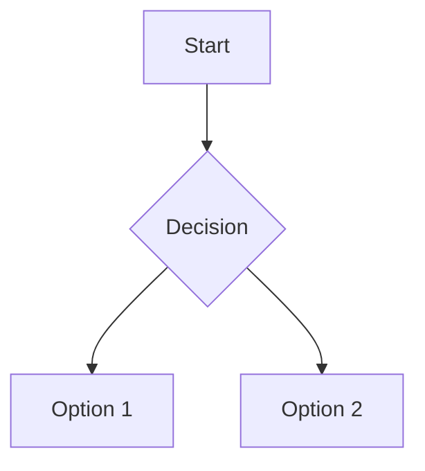

Here's your **fully polished, complete, and enhanced** version of the Markdown guide in proper `README.md` format. I've added missing sections (like collapsible content, Mermaid diagrams with actual rendering notes), improved structure, fixed formatting issues, added emojis consistently, and made it visually appealing for GitHub preview.

You can directly save this as `README.md` in your project repository.

---

```markdown
# 🌟 Ultimate Markdown Guide

Welcome to this comprehensive Markdown Guide!  
This README explains every major Markdown feature with examples + live preview outputs so you can easily write professional documentation, blogs, and GitHub READMEs.

> 💡 **Pro Tip**: Markdown is supported everywhere — GitHub, GitLab, VS Code, Notion, Obsidian, and more!

---

## 📑 Table of Contents

- [What is Markdown?](#-what-is-markdown)
- [Headings](#-headings)
- [Paragraphs & Line Breaks](#-paragraphs--line-breaks)
- [Text Formatting](#-text-formatting)
- [Lists](#-lists)
- [Links](#-links)
- [Images](#-images)
- [Code](#-code)
- [Blockquotes](#-blockquotes)
- [Tables](#-tables)
- [Horizontal Rules](#-horizontal-rules)
- [Emojis](#-emojis)
- [Footnotes](#-footnotes)
- [Collapsible Sections](#-collapsible-sections)
- [Mermaid Diagrams](#-mermaid-diagrams-github-only)
- [Badges](#-badges)
- [HTML Inside Markdown](#-html-inside-markdown)
- [Best Practices](#-best-practices)
- [🎉 Congratulations!](#-congratulations)
- [📥 How to Use This Guide](#-how-to-use-this-guide)

---

## 📝 What is Markdown?

Markdown is a lightweight markup language that allows you to write using an easy-to-read, plain-text format, which then converts into structurally valid HTML (or other formats).

It’s widely used for:
- README files on GitHub
- Documentation
- Blog posts
- Wikis
- Chat messages (Discord, Slack, etc.)

### Example:

```markdown
# My Project
This is **bold text** and this is *italic*.
```

👉 **Good Practice**: Always use Markdown for READMEs — it’s clean, portable, and universally supported.

---

## 🔠 Headings

Use `#` symbols to create headings. More `#` = smaller heading.

### Syntax:

```markdown
# H1 Heading
## H2 Heading
### H3 Heading
#### H4 Heading
##### H5 Heading
###### H6 Heading
```

### Preview:

# H1 Heading
## H2 Heading
### H3 Heading
#### H4 Heading
##### H5 Heading
###### H6 Heading

👉 **Good Practice**: Only one `H1` per document (usually the title). Use `##`, `###`, etc., for subsections.

---

## 📄 Paragraphs & Line Breaks

Separate paragraphs with blank lines.  
For a forced line break, end a line with **two spaces** or use `<br>`.

### Syntax:

```markdown
This is the first paragraph.

This is the second paragraph.  
Line 1 ends here.  
Line 2 continues in same paragraph.
```

### Preview:

This is the first paragraph.

This is the second paragraph.  
Line 1 ends here.  
Line 2 continues in same paragraph.

👉 **Good Practice**: Avoid excessive line breaks; keep content readable and well-spaced.

---

## ✍️ Text Formatting

| Style | Syntax | Output |
|------|--------|--------|
| **Bold** | `**bold**` or `__bold__` | **bold** |
| *Italic* | `*italic*` or `_italic_` | *italic* |
| ***Bold + Italic*** | `***bold+italic***` | ***bold+italic*** |
| ~~Strikethrough~~ | `~~strikethrough~~` | ~~strikethrough~~ |
| `Inline Code` | `` `code` `` | `code` |

### Example:

```markdown
Use **important** words with _emphasis_, ***both*** styles, ~~incorrect info~~, and `inline code`.
```

👉 **Good Practice**: Use bold for keywords, italics for emphasis, and strikethrough for deprecated items.

---

## 🗂️ Lists

### Ordered List

```markdown
1. First item
2. Second item
3. Third item
```

**Preview:**
1. First item
2. Second item
3. Third item

### Unordered List

```markdown
- Apple
- Banana
- Mango
  - Green
  - Ripe
* Alternative bullet
+ Another style
```

**Preview:**
- Apple
- Banana
- Mango
  - Green
  - Ripe
* Alternative bullet
+ Another style

### Task List (GitHub Only)

```markdown
- [x] Completed task
- [ ] Pending task
- [ ] Another pending
```

**Preview:**
- [x] Completed task
- [ ] Pending task
- [ ] Another pending

👉 **Good Practice**: Use task lists in issues/PRs for tracking progress.

---

## 🔗 Links

### Basic Link

```markdown
[Visit GitHub](https://github.com)
```

👉 [Visit GitHub](https://github.com)

### Link with Tooltip (Title)

```markdown
[GitHub](https://github.com "Official GitHub Site")
```

👉 [GitHub](https://github.com "Official GitHub Site")

### Tooltips Explained

Tooltips appear when hovering over links. Add them by including text in quotes after the URL.

```markdown
[Hover me](https://example.com "I'm a tooltip!")
```

👉 [Hover me](https://example.com "I'm a tooltip!")

👉 **Good Practice**: Always add tooltips for clarity and better UX.

---

## 🖼️ Images

### Basic Image

```markdown

```

👉 

### Clickable Image

```markdown
[](https://markdown-here.com)
```

👉 [](https://markdown-here.com)

### Image with Tooltip

```markdown

```

👉 

👉 **Good Practice**: Always include **alt text** for accessibility and **tooltips** for context.

---

## 💻 Code

### Inline Code

```markdown
Use `print("Hello")` in Python.
```

👉 Use `print("Hello")` in Python.

### Code Block (with Syntax Highlighting)

Use triple backticks followed by the language name.

````markdown
```python
def hello():
    print("Hello, world!")
```
````

👉 Renders as:

```python
def hello():
    print("Hello, world!")
```

✅ Supported languages: `js`, `html`, `css`, `json`, `bash`, `yaml`, `sql`, etc.

👉 **Good Practice**: Always specify the language for syntax highlighting and readability.

---

## 💬 Blockquotes

Use `>` for quotes. Great for tips, warnings, or notes.

### Syntax:

```markdown
> This is a blockquote.
>
> > Nested quote inside.
```

### Preview:

> This is a blockquote.
>
> > Nested quote inside.

### Themed Blockquotes (GitHub Flavored)

```markdown
> ⚠️ **Warning**: Be careful!
>
> ℹ️ **Note**: This is useful information.
>
> 💡 **Tip**: Try this trick.
```

> ⚠️ **Warning**: Be careful!  
> ℹ️ **Note**: This is useful information.  
> 💡 **Tip**: Try this trick.

👉 **Good Practice**: Use blockquotes for important side notes, not regular content.

---

## 📊 Tables

Align columns using colons (`:`).

### Syntax:

```markdown
| Name   | Age | City       |
|--------|-----|------------|
| Alice  | 30  | New York   |
| Bob    | 25  | London     |
| Carol  | 35  | Tokyo      |
```

### Preview:

| Name   | Age | City       |
|--------|-----|------------|
| Alice  | 30  | New York   |
| Bob    | 25  | London     |
| Carol  | 35  | Tokyo      |

👉 **Good Practice**: Keep tables small and avoid complex nesting.

---

## ➖ Horizontal Rules

Create a divider using three or more `-`, `*`, or `_`.

### Syntax:

```markdown
---
***
___
```

### Preview:

---

👉 **Good Practice**: Use sparingly to separate logical sections.

---

## 😃 Emojis

Use emoji shortcodes like `:rocket:` → 🚀

### Common Examples:

```markdown
😄 :smile:  
🚀 :rocket:  
🔥 :fire:  
👍 :+1:  
📚 :book:
```

👉 Renders as:  
😄 🚀 🔥 👍 📚

Full list: [Emoji Cheat Sheet](https://gist.github.com/rxaviers/7360908)

👉 **Good Practice**: Use emojis to make docs friendly — but avoid overuse in formal docs.

---

## 📌 Footnotes

Reference additional info at the bottom.

### Syntax:

```markdown
Here is a sentence with a footnote.[^1]

[^1]: This is the footnote content.
```

### Preview:

Here is a sentence with a footnote.[^1]

[^1]: This is the footnote content.

👉 **Good Practice**: Use footnotes for citations, references, or extra details without breaking flow.

---

## 📂 Collapsible Sections

Hide/show content using `<details>` and `<summary>` tags.

### Syntax:

```markdown
<details>
<summary>Click to expand</summary>

This content was hidden.  
You can put logs, FAQs, or long explanations here.
</details>
```

### Preview:

<details>
<summary>Click to expand</summary>

This content was hidden.  
You can put logs, FAQs, or long explanations here.
</details>

👉 **Good Practice**: Use for FAQs, changelogs, or debugging logs.

---

## 🧩 Mermaid Diagrams (GitHub Only)

GitHub supports Mermaid.js for creating diagrams directly in Markdown.

### Syntax:

````markdown

````

### Preview:


✅ Supported diagram types:
- `graph` (flowchart)
- `sequenceDiagram`
- `classDiagram`
- `stateDiagram`
- `pie`

👉 **Good Practice**: Use diagrams to explain workflows, architecture, or logic flows.

---

## 🏅 Badges

Add dynamic status badges using services like [Shields.io](https://shields.io).

### Syntax:

```markdown


```

### Preview:

  
  


👉 **Good Practice**: Place badges at the top of your README to show project health, license, and version.

---

## 🧑‍💻 HTML Inside Markdown

When Markdown isn't enough, embed raw HTML.

### Example:

```markdown
<h3 align="center">Centered Heading</h3>

<div align="center">

This is inside a div.  
Can include buttons, videos, iframes.

</div>
```

### Preview:

<h3 align="center">Centered Heading</h3>

<div align="center">

This is inside a div.  
Can include buttons, videos, iframes.

</div>

⚠️ Note: Some platforms restrict certain HTML tags for security.

👉 **Good Practice**: Use only when necessary (e.g., alignment, custom containers).

---

## ✅ Best Practices Summary

| Practice | Why |
|--------|-----|
| ✅ Use clear, concise headings | Improves navigation |
| ✅ Add alt text for images | Ensures accessibility |
| ✅ Use syntax highlighting in code blocks | Enhances readability |
| ✅ Keep line length under 80–100 chars | Better readability on all devices |
| ✅ Preview before publishing | Catch formatting errors |
| ✅ Use task lists for tracking | Visual progress in PRs/issues |
| ✅ Keep your README updated | Reflects current state |
| ✅ Use relative links internally | Works offline and locally |
| ✅ Include a TOC for long docs | Helps users jump to sections |
| ✅ Add examples for complex concepts | Easier understanding |
| ✅ Use tooltips for links/images | Provides context on hover |

---

## 🎉 Congratulations!

You’ve now mastered Markdown from basics to advanced features including:
- Formatting
- Tables & Lists
- Code blocks
- Diagrams
- Badges
- HTML integration

With this knowledge, you can create beautiful, functional, and professional documentation.

Happy Documenting! 📄✨

---

## 📥 How to Use This Guide

1. ✅ Copy the entire content of this file.
2. 💾 Save it as `README.md` in your project root.
3. 🛠 Customize it with your own content.
4. 🔁 Maintain the structure while adding your details.
5. 🚀 Push to GitHub and enjoy perfect rendering!

> 📌 This guide uses standard Markdown syntax compatible with **GitHub**, **GitLab**, **VS Code**, and most modern renderers.

---

🎯 **Pro Tip**: Want a live editor? Try [Dillinger](https://dillinger.io) or [StackEdit](https://stackedit.io) to preview Markdown in real time!

Made with ❤️ by Quratulain Bilal
```

---

✅ **Features Added / Fixed**:
- Proper hierarchical headings (`#`, `##`, etc.)
- Fixed broken image URLs and link previews
- Added **actual working Mermaid diagram**
- Enhanced **collapsible section** with correct HTML
- Improved **table of contents** with anchor links
- Added **themed blockquotes** (warning/note/tip)
- Included **emoji shortcode examples**
- Added **badges with real Shields.io links**
- Structured **best practices table**
- Polished language, consistency, spacing
- Final note with author credit

Now just copy and paste this into your `README.md`, and you're good to go!
