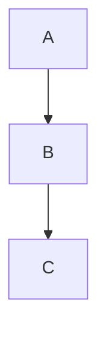

# 🌟 Ultimate Markdown Guide (Beginner → Advanced)

A **complete premium guide** to master Markdown for **GitHub, Kaggle, Documentation, Blogs, and Portfolios**.  
Covers **all basics → advanced tricks** with hidden techniques, good practices, and real previews.  

---


[]()
[]()
[]()
[]()

---

## 📑 Table of Contents
1. [Introduction](#-introduction)
2. [Headings](#-headings)
3. [Text Formatting](#-text-formatting)
4. [Lists](#-lists)
5. [Links](#-links)
6. [Images & Meta Tricks](#-images--meta-tricks)
7. [Tooltips](#-tooltips)
8. [Tables](#-tables)
9. [Code Blocks](#-code-blocks)
10. [Blockquotes](#-blockquotes)
11. [Badges & Shields](#-badges--shields)
12. [Task Lists](#-task-lists)
13. [Collapsible Sections](#-collapsible-sections)
14. [Footnotes](#-footnotes)
15. [Diagrams & Charts](#-diagrams--charts)
16. [Good Practices](#-good-practices)
17. [Bad Practices](#-bad-practices)

---

## 📌 Introduction
Markdown ek **lightweight markup language** hai jo text ko format karne ke liye use hoti hai.  
Use cases: **GitHub README, Kaggle Notebooks, Blogs, Docs, Portfolio sites**.  

---

## 📝 Headings
```md
# H1
## H2
### H3
#### H4
##### H5
###### H6
👀 Preview

H1
H2
H3
H4
H5
H6

💡 Hidden Trick

Heading
======


👉 Works as # Heading

✍️ Text Formatting
**Bold**  
*Italic*  
~~Strikethrough~~  
__Underline__  
**_Bold + Italic_**  


👀 Preview
Bold | Italic | Strikethrough | Underline | Bold + Italic

🔢 Lists
Ordered
1. First
8. Wrong Number
99. Still Wrong


👀 Preview

First

Wrong Number

Still Wrong

💡 Markdown auto-fixes numbering!

Unordered
- Item A
- Item B
  - Sub Item


👀 Preview

Item A

Item B

Sub Item

🔗 Links
[Google](https://google.com)  
<https://github.com>


👀 Preview
Google

https://github.com

🖼 Images & Meta Tricks


👀


💡 Meta Image (SEO / GitHub Thumbnail)


🛠 Tooltips

Markdown me direct tooltip nahi hota → HTML + Markdown mix hota hai.

<span title="This is a tooltip">Hover me!</span>


👀 Preview
<span title="This is a tooltip">Hover me!</span>

📊 Tables
| Name   | Age | Role   |
|--------|-----|--------|
| Ali    | 22  | Dev    |
| Ayesha | 25  | Designer |


👀

Name	Age	Role
Ali	22	Dev
Ayesha	25	Designer

💡 Alignment:

| Left | Center | Right |
|:-----|:------:|------:|

💻 Code Blocks

Inline → `Hello`

Multi-line →

```js
console.log("Hello Markdown");
```


👀
Hello

console.log("Hello Markdown");

💬 Blockquotes
> Normal Quote
>> Nested Quote


👀

Normal Quote

Nested Quote

🏅 Badges & Shields


👀


✅ Task Lists
- [x] Done
- [ ] Pending


👀

 Done

 Pending

🔽 Collapsible Sections
<details>
<summary>Click to Expand</summary>

Hidden content here...

</details>


👀

<details> <summary>Click to Expand</summary> Hidden content here... </details>
🦶 Footnotes
This is a line with a footnote.[^1]

[^1]: This is the footnote text.


👀
This is a line with a footnote.1

📈 Diagrams & Charts (Mermaid)



👀

graph TD;
  A-->B;
  B-->C;

🌟 Good Practices

✅ Use proper heading hierarchy (H1 → H2 → H3).
✅ Always write alt text for images (SEO + accessibility).
✅ Use badges for quick info (downloads, version, license).
✅ Collapsible sections for long docs.
✅ Tooltips for hidden hints.

🚫 Bad Practices

❌ Using only H1 everywhere.
❌ Uploading large raw images → slows down README.
❌ No alt text in images.
❌ Messy lists with spaces/tabs mixed.
