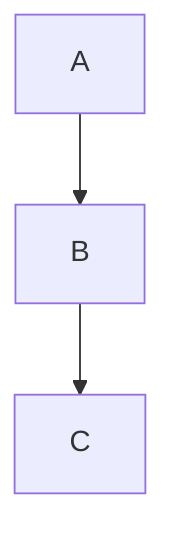

🌟 The Ultimate Markdown Master Guide

A complete beginner-to-advanced guide on Markdown with hidden techniques, good practices, and examples.
Perfect for GitHub ReadMe, Documentation, Notes, Blogs, and Kaggle Notebooks.

🗂 Table of Contents

Introduction

Headings

Text Formatting

Lists

Links

Images & Meta Tricks

Tooltips (Hover Notes)

Tables

Code Blocks

Blockquotes

Badges & Shields

Task Lists

Collapsible Sections

Footnotes

Diagrams & Charts

Good Practices

Bad Practices

📌 Introduction

Markdown ek lightweight markup language hai jo text ko easily format karne ke liye use hoti hai.
GitHub, Kaggle, Reddit, Discord aur bohot jagah use hoti hai.

👉 Best part? Plain text → Rich formatting without extra tools.

📝 Headings
# H1 (Main Title)
## H2 (Section Title)
### H3 (Subsection)
#### H4
##### H5
###### H6


👀 Preview:

H1
H2
H3
H4
H5
H6

⚡ Hidden Fact: Agar aap # Heading ke neeche === likho to wo bhi H1 ban jata hai.

Heading  
======

✍️ Text Formatting
**Bold Text**
*Italic Text*
~~Strikethrough~~
__Underline (GitHub flavored)__


👀 Preview:
Bold, Italic, Strike, Underline

⚡ Pro Tip: **_Bold & Italic_** → Bold + Italic

🔢 Lists
✅ Ordered List
1. Item One
2. Item Two
   1. Sub Item
   2. Sub Item


👀 Preview

Item One

Item Two

Sub Item

Sub Item

⚡ Hidden Trick: Agar numbering galat likho, Markdown khud theek kar deta hai.

1. Item One  
12. Item Two  
99. Item Three  


👉 Automatically → 1, 2, 3

🔹 Unordered List
- Item A
- Item B
  - Sub Item


👀 Preview:

Item A

Item B

Sub Item

🔗 Links
[Google](https://google.com)


👀 Google

⚡ Pro Tip:

<https://github.com>


👉 Auto converts to link.

🖼 Images & Meta Tricks


👀

⚡ Hidden Technique (Meta Image for GitHub SEO):


👉 Ye image GitHub project page pe preview thumbnail ban jata hai.

🛠 Tooltips (Hover Notes)

Markdown me direct tooltip nahi hota, but HTML + Markdown mix karke banate hain:

<span title="This is a tooltip">Hover me!</span>


👀 Preview:
<span title="This is a tooltip">Hover me!</span>

⚡ Trick: Tooltips documentation me hints dene ke liye best hote hain.

📊 Tables
| Name   | Age | Role   |
|--------|-----|--------|
| Ali    | 22  | Dev    |
| Ayesha | 25  | Designer |


👀 Preview

Name	Age	Role
Ali	22	Dev
Ayesha	25	Designer

⚡ Alignment:

| Left | Center | Right |
|:-----|:------:|------:|

💻 Code Blocks
`Inline Code`

```js
console.log("Hello World");
```


👀 Preview:
Inline Code

console.log("Hello World");

💬 Blockquotes
> This is a quote
>> Nested Quote


👀 Preview

This is a quote

Nested Quote

🏅 Badges & Shields

Badges GitHub projects me status, version, downloads show karte hain.


👀 Preview


✅ Task Lists
- [x] Done
- [ ] Pending


👀

 Done

 Pending

🔽 Collapsible Sections
<details>
<summary>Click to Expand</summary>

Hidden content here...

</details>


👀 Preview

<details> <summary>Click to Expand</summary> Hidden content here... </details>
🦶 Footnotes
This is a sentence with a footnote.[^1]

[^1]: This is the footnote text.


👀 Preview
This is a sentence with a footnote.1

📈 Diagrams & Charts

Support via Mermaid
:




👀 Preview

graph TD;
  A-->B;
  B-->C;

🌟 Good Practices

✅ Use headings properly (H1 → H2 → H3).
✅ Add alt text in images for SEO.
✅ Use tables for structured data.
✅ Add badges for clarity.
✅ Use tooltips for hidden hints.

🚫 Bad Practices

❌ Using only H1 everywhere.
❌ Adding very large images without resizing.
❌ Mixing tabs & spaces in lists.
❌ Not writing alt text in images.
