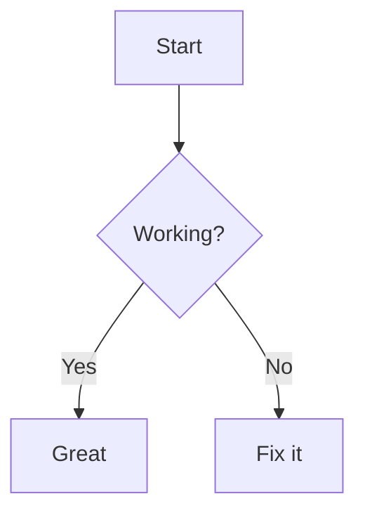

🌟 Ultimate Markdown Guide
Welcome to this comprehensive Markdown Guide!
This README explains every major Markdown feature with examples + preview outputs so you can easily write professional documentation and GitHub READMEs.

📑 Table of Contents
What is Markdown?

Headings

Paragraphs & Line Breaks

Text Formatting

Lists

Links

Images

Code

Blockquotes

Tables

Horizontal Rules

Emojis

Footnotes

Collapsible Sections

Mermaid Diagrams

Badges

HTML Inside Markdown

Best Practices

📝 What is Markdown?
Markdown is a lightweight markup language used for READMEs, blogs, and docs.
It converts plain text into formatted content like headings, bold, lists, and links.

Example:

markdown
# Heading
This is **bold** text.
👉 Good Practice: Always use Markdown for README files because GitHub and most documentation tools support it by default.

🔠 Headings
Use # for headings. More # = smaller heading.

Syntax:

markdown
# H1 Heading  
## H2 Heading  
### H3 Heading  
#### H4 Heading
Preview:

H1 Heading
H2 Heading
H3 Heading
H4 Heading
👉 Good Practice: Keep only one H1 per page. Use ## and ### for subsections.

📄 Paragraphs & Line Breaks
Paragraphs are separated by blank lines.
To force a line break → end a line with two spaces.

Syntax:

markdown
This is first paragraph.  

This is second paragraph.  
Line 1.  
Line 2 (same paragraph, forced break).
Preview:
This is first paragraph.

This is second paragraph.
Line 1.
Line 2 (same paragraph, forced break).

👉 Good Practice: Do not overuse line breaks; keep paragraphs clean and readable.

✍️ Text Formatting
Style	Syntax	Example Output
Bold	**bold**	bold
Italic	*italic*	italic
Both	***bold+italic***	bold+italic
Strikethrough	~~text~~	~~text~~
Inline code	`code`	code
Syntax:

markdown
**bold**, *italic*, ***bold+italic***, ~~strikethrough~~, and `inline code`
Preview:
bold, italic, bold+italic, ~~strikethrough~~, and inline code

👉 Good Practice: Use bold for keywords and italics for emphasis.

🗂️ Lists
Ordered List
Syntax:

markdown
1. First  
2. Second  
3. Third
Preview:

First

Second

Third

Unordered List
Syntax:

markdown
- Apple  
- Banana  
- Mango

* Alternative bullet  
* Another item
Preview:

Apple

Banana

Mango

Alternative bullet

Another item

Task List (GitHub only)
Syntax:

markdown
- [x] Completed  
- [ ] Pending
Preview:

Completed

Pending

👉 Good Practice: Use task lists for project tracking in issues & PRs.

🔗 Links
Syntax:

markdown
[GitHub](https://github.com)  
[GitHub with tooltip](https://github.com "Go to GitHub")
Preview:
GitHub
GitHub with tooltip

Tooltips in Markdown
Tooltips provide additional information when hovering over text. In Markdown, you can add tooltips to links by including the text in quotation marks after the URL.

Syntax:

markdown
[Link Text](URL "Tooltip Text")
Example:

markdown
[Hover over me](https://example.com "This is a tooltip!")
Preview:
Hover over me

👉 Good Practice: Always add tooltips for clarity and better user experience.

🖼️ Images
Syntax:

markdown
  
[](https://github.com)
Preview:
https://markdown-here.com/img/icon256.png

Image Tooltips
You can also add tooltips to images for additional context:

Syntax:

markdown

Example:

markdown

Preview:
https://markdown-here.com/img/icon256.png

👉 Good Practice: Always add alt text for accessibility and tooltips for additional context.

💻 Code
Inline Code
Syntax:

markdown
Use `print("Hello")` in Python.
Preview:
Use print("Hello") in Python.

Code Block
Syntax:

markdown
```python
def hello():
    print("Hello, world!")
```
Preview:

python
def hello():
    print("Hello, world!")
👉 Good Practice: Always specify language (python, js, etc.) for syntax highlighting.

💬 Blockquotes
Syntax:

markdown
> This is a quote.  
>> Nested Quote
Preview:

This is a quote.

Nested Quote

👉 Good Practice: Use blockquotes for tips, notes, or warnings.

📊 Tables
Syntax:

markdown
| Name  | Age | City     |
|-------|-----|----------|
| Alice | 30  | New York |
| Bob   | 25  | London   |
Preview:

Name	Age	City
Alice	30	New York
Bob	25	London
👉 Good Practice: Keep tables small for readability.

➖ Horizontal Rules
Syntax:

markdown
---
Preview:

👉 Good Practice: Use sparingly to separate sections.

😃 Emojis
Syntax:

markdown
😄 🚀 🔥 👍
Preview: 😄 🚀 🔥 👍

👉 Good Practice: Use for fun, but not in professional docs.

📌 Footnotes
Syntax:

markdown
Here is a sentence with a footnote.[^1]  

[^1]: This is the footnote content.
Preview:
Here is a sentence with a footnote.

👉 Good Practice: Use footnotes for references.

📂 Collapsible Sections
Syntax:

markdown
<details>
  <summary>Click to expand</summary>
  Hidden content here.
</details>
Preview:

<details> <summary>Click to expand</summary> Hidden content here. </details>
👉 Good Practice: Use collapsibles for FAQs & long logs.

🧩 Mermaid Diagrams (GitHub only)
Syntax:

markdown

Preview:

Diagram
Code


👉 Good Practice: Use diagrams for workflows.

🏅 Badges
Syntax:

markdown
  

Preview:
https://img.shields.io/badge/build-passing-brightgreen
https://img.shields.io/badge/license-MIT-blue

👉 Good Practice: Show status, license, and version at top of README.

🧑‍💻 HTML Inside Markdown
Syntax:

markdown
<div align="center">
  <h3>Centered Heading</h3>
  <p>This is inside a div</p>
</div>
Preview:

<div align="center"> <h3>Centered Heading</h3> <p>This is inside a div</p> </div>
👉 Good Practice: Use only when Markdown cannot achieve desired layout.

✅ Best Practices
Use clear, concise headings

Add alt text for images

Use syntax highlighting in code blocks

Keep line length under 80–100 chars

Preview before publishing

Use task lists for tracking

Keep your README updated

Use relative links for internal documentation

Add a table of contents for long documents

Include examples for complex concepts

Add tooltips to links and images for better context

🎉 Congratulations!


